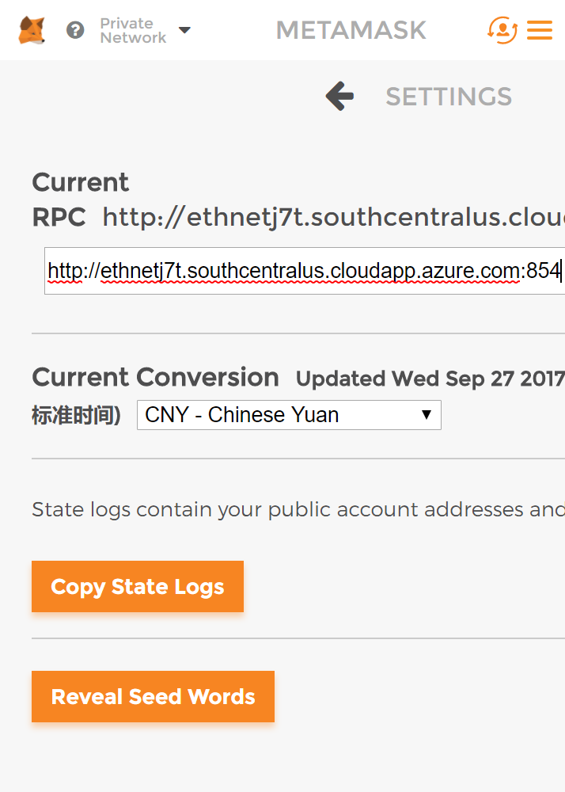
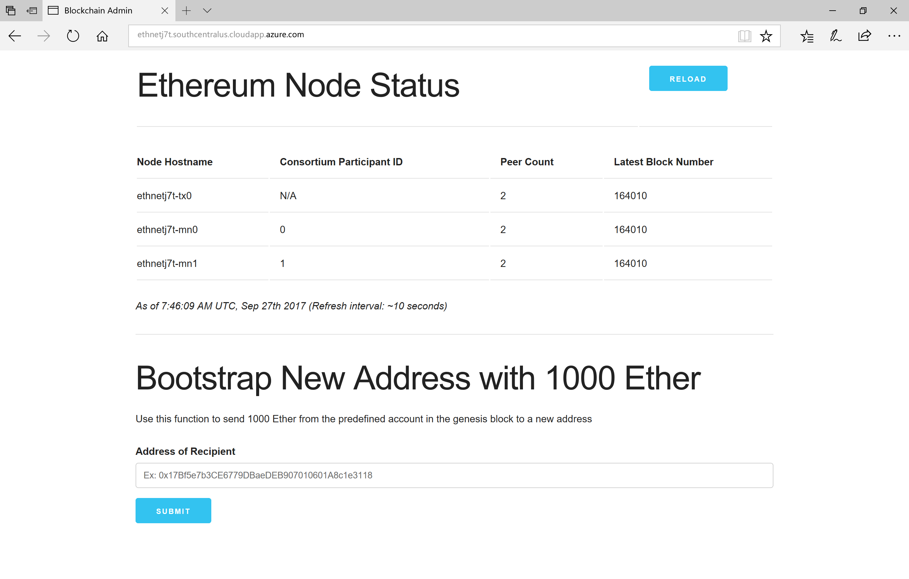

# Pet Shop

Pet shop is modify from the [Pet Shop Box](http://truffleframework.com/tutorials/pet-shop).

## Prerequisite

### Install Matemask on Chrome Web Store

[MateMask](https://metamask.io/) is a Chrome Extension to connect to an Ethereum network. You can install this extension on [Chrome Web Store](https://chrome.google.com/webstore/detail/metamask/nkbihfbeogaeaoehlefnkodbefgpgknn?utm_source=chrome-ntp-icon).

### Deploy Pet Shop Smart Contract on Private Chain

#### Switch Your Matemask Endpoint to Private Chain

Once Matemask has being installed, we need to change it to connect the private chain we provisioned.



#### Allocate Ether to Your Ethereum Account

Then you should to allocate some ethers to your Ethereum account in Matemask:

1. Copy the address of Ethereum account in Matemask to which you want to transfer ether
2. Get the URL of administrator page from the provision step when create private chain in Cloud Foundry, and go to the administrator page
3. Paste your address in "Address of Recipient" and click "SUBMIT" button.



#### Deploy Smart Contract

Once your account owns some Ether, you can create smart contract with the account on your private chain. For this, we will use the [Broswer Solidity project](https://ethereum.github.io/browser-solidity/), which supports Matemask and allows you to deploy smart contract on private chain directly in your broswer.

1. Click "Add local file" in the upper left and choose `Adoption.sol` in contracts directory.
2. Click "Run", switch `Environment` into `Injected Web3`, and click `Create` to deploy smart contract into private chain.
3. Copy the contract address and paste it in `src/Adoption.json`.

## Usage

```
git clone https://github.com/zeqing-guo/pet-shop-box.git
cd pet-shop-box
cf push
```

After push the app to cloud foundry, you can open the URL in broswer.

**Note:** you need to switch your Matemask to connect private chain before use pet shop.


